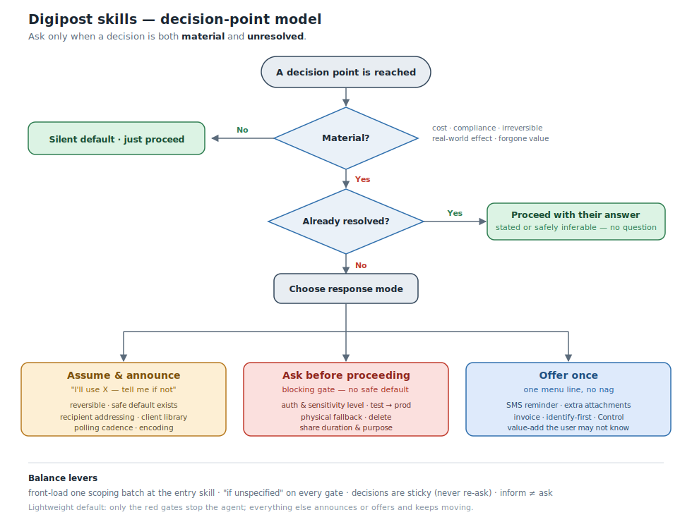
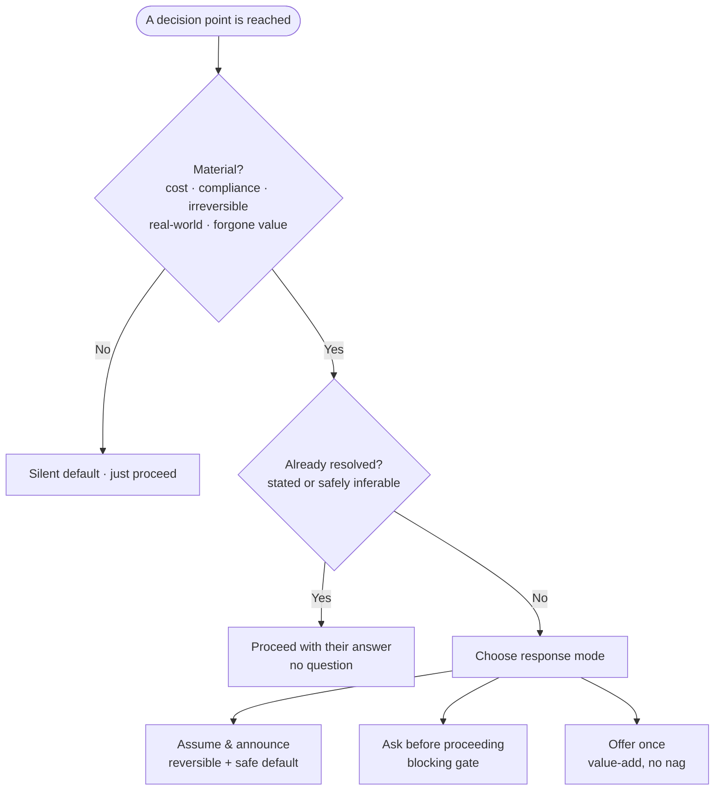

# Decision points in the Digipost skills — a proposal

**Status:** draft for team review · **Date:** 2026-07-14

## The problem we're solving

An integration process varies widely between customers. We want the skills to:

- make **beginners feel in control** and informed of features they might want,
- **not bombard people with a plan** with questions they already know the answer to, and
- surface the features that also **provide value to Digipost**.

The insight that ties these together: the features worth a question are mostly the ones that
**cost money or carry compliance/privacy weight** — which is exactly where the customer's interest
and Digipost's interest overlap. (From the price list: two-factor auth +1.35 kr/msg,
SMS notification +0.46 kr, each attachment +0.54 kr, and physical print ~6–18× the price of digital.
Control is subscription-gated.) Picking a silent default at those points spends the customer's money
and forgoes value they might have wanted.

## Core principle: two gates

At any decision point, the agent asks **only if both gates are true**:

1. **Material** — getting it wrong costs money, breaks compliance, is irreversible, sends something
   real-world, or silently forgoes a feature the user would plausibly want.
2. **Unresolved** — the user hasn't already stated it, and it can't be safely inferred from their
   stated goal, their stack, or their data.

Gate 2 is what protects the person with a plan. *"Send a two-factor invoice to a fødselsnummer in
test"* trips **zero** questions — auth level, environment, recipient type, and feature are all
already resolved. *"I want to send a letter"* trips every gate and gets guided.

## Response modes (lightest touch first)

Once a decision passes both gates, how heavily we surface it depends on the mode:

| Mode | When to use | How it reads |
| --- | --- | --- |
| **Silent default** | Trivial, reversible, one obviously-correct answer | (no message — just proceed) |
| **Assume & announce** | Reversible, a safe default exists, but the user should know | "I'll use X — tell me if that's not right" |
| **Ask before proceeding** (blocking) | Material with **no safe default**: compliance, cost, irreversible, go-live | A real question; the agent waits |
| **Offer once** | A value-add the user may not know exists | One menu line; mention once, don't nag |

**Lightweight default (agreed for now):** only the *Ask before proceeding* gates actually stop the
agent. Everything else announces or offers and keeps moving. Easy to tighten later if we find people
want more hand-holding.

## The decision structure

Same flow as Mermaid (for editing)

**Balance levers** (these are what make it feel right in practice):

- **Front-load one scoping batch** at the `digipost` entry skill (stack, environment, flow, volume)
  so downstream skills inherit the answers instead of re-asking.
- **"If unspecified"** on every gate — the phrase that suppresses questions for planned users.
- **Sticky decisions** — never re-ask environment / stack / sender-id within a session.
- **Inform ≠ ask** — value-adds are a one-line offer, never a gate.

## The decision-point map (concrete)

Legend: 🔴 Ask before proceeding · 🟡 Assume & announce · 🔵 Offer once · 🟢 Silent default

### `digipost` (entry) — the scoping batch
| Decision | Mode | Why |
| --- | --- | --- |
| Language / stack | 🟡 infer, announce | Decides client-library vs hand-roll; usually obvious from context |
| Test vs production | 🔴 | Production = real mail, real charges |
| Which flow | 🟡/ask if unclear | Routes to the right skill |
| Volume (one-off vs bulk) | 🟡 | Shapes looping / polling advice |

### `digipost-send-post`
| Decision | Mode | Why | Where |
| --- | --- | --- | --- |
| `authentication-level` | 🔴 | Compliance; 2FA also costs +1.35 kr/msg | [SKILL.md:42](../digipost-send-post/SKILL.md#L42) |
| `sensitivity-level` | 🔴 | Controls metadata exposure in notifications | [SKILL.md:47](../digipost-send-post/SKILL.md#L47) |
| Test → production switch | 🔴 | Go-live: real mail, real charges | [SKILL.md:78](../digipost-send-post/SKILL.md#L78) |
| Physical-mail fallback | 🔴 | ~6–18× cost; needs postal + return address | [physical-mail-fallback.md](../digipost-send-post/references/physical-mail-fallback.md) |
| SMS notification | 🔵 | Value-add, +0.46 kr | [SKILL.md:66](../digipost-send-post/SKILL.md#L66) |
| Extra attachments | 🔵/🟡 | +0.54 kr each | [request-anatomy.md](../digipost-send-post/references/request-anatomy.md) |
| Invoice data type | 🔵 | Feature the user may want | [SKILL.md:74](../digipost-send-post/SKILL.md#L74) |
| Identify-first (`POST /identification`) | 🔵/🟡 | Optional step, not mandatory | [recipient-identification.md](../digipost-send-post/references/recipient-identification.md) |
| Recipient addressing method | 🟡 | Inferable from the data they hold | [recipient-identification.md](../digipost-send-post/references/recipient-identification.md) |
| Encoding (UTF-8) | 🟢 | One correct answer | [request-anatomy.md](../digipost-send-post/references/request-anatomy.md) |

### `digipost-control`
| Decision | Mode | Why | Where |
| --- | --- | --- | --- |
| `purpose` | 🔴 | Shown to the user as the consent prompt; weak text loses trust | [share-lifecycle.md:37](../digipost-control/references/share-lifecycle.md#L37) |
| `max-share-duration-seconds` | 🔴 | Privacy / data-minimisation; hard ceiling once granted | [share-lifecycle.md:40](../digipost-control/references/share-lifecycle.md#L40) |
| Subscription-tier awareness | 🔵 | Control is subscription-gated (99/199/custom) | pricing page |
| Stop-sharing when done | 🟡 | Good practice; announce the default | [share-lifecycle.md:116](../digipost-control/references/share-lifecycle.md#L116) |
| Event feed vs per-request polling | 🟡 | Inferable from volume of outstanding requests | [share-lifecycle.md:84](../digipost-control/references/share-lifecycle.md#L84) |

### `digipost-manage-inbox`
| Decision | Mode | Why | Where |
| --- | --- | --- | --- |
| Delete after retrieval | 🔴 | Irreversible; deletion is optional | [document-retrieval-and-delete.md:23](../digipost-manage-inbox/references/document-retrieval-and-delete.md#L23) |
| Track by document id / cursor | 🟢 | One correct answer | [inbox-anatomy.md](../digipost-manage-inbox/references/inbox-anatomy.md) |
| `reference-from-sender` correlation | 🟡 | Announce as the robust join key when present | [inbox-anatomy.md:45](../digipost-manage-inbox/references/inbox-anatomy.md#L45) |

### `digipost-auth-and-signing`
| Decision | Mode | Why |
| --- | --- | --- |
| Client library vs hand-roll | 🟡 | Determined by stack; announce the recommendation |

## Ways to implement this in the existing skill structure

The skills already share one convention: facts live once in the entry skill's `references/`, and
skills route to each other **by name** (never by path) to stay portable. Four options, in order of
preference:

1. **Shared rubric + a compact per-skill block** *(recommended)*
   Add `digipost/references/decision-points.md` describing the two gates + four modes. Each flow
   skill gets a short **"Decision points (ask only if unspecified)"** section listing just its own
   🔴 gates and 🔵 offers, referencing the rubric by name.
   *Pros:* matches the existing architecture; the rubric is stated once; portable across agents.
   *Cons:* one new reference file.

2. **Fold the rubric into `conventions.md`**
   No new file; the gates/modes become another shared convention.
   *Pros:* lightest footprint. *Cons:* mixes "facts" with "behaviour"; `conventions.md` grows.

3. **Per-skill only, no shared rubric**
   Each skill states its own gates inline with no central definition.
   *Pros:* every skill fully self-contained. *Cons:* the rubric wording is duplicated and will drift.

4. **Encode in tooling / frontmatter** (out of scope)
   Skills are prose today; a machine-readable schema is a bigger change than this pass warrants.

**Recommendation:** Option 1, in its lightweight form — the shared rubric plus a ~5-line
"Decision points" block in each flow skill and the scoping batch in the entry skill. Small, reversible,
and consistent with how the skills already work.

## Deliberately out of scope for this pass

Gaps found while cross-referencing that we are **not** acting on yet (likely gated on API support —
some of these services are currently web-only):

- **Recommended Post / opening receipts (åpningskvittering)** — the delivery+opening confirmation
  people keep asking about.
- **Digital signature (e-signing)** — a distinct product; note the naming trap that
  `digipost-auth-and-signing` is about *request* signing, not document e-signature.
- **Send to Many** — the product name for the multi-recipient loop the send skill already describes.
